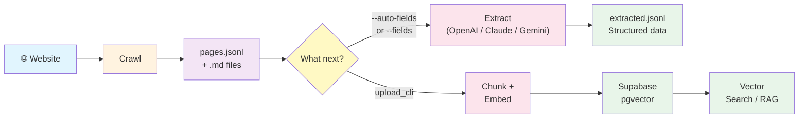

# MarkCrawl by iD8 🕷️📝
### Fast Python Web Crawler for AI & RAG Ingestion

Crawl websites, extract clean Markdown, pull structured data with LLMs, and store embeddings for vector search — all from one tool.

```bash
pip install markcrawl
markcrawl --base https://docs.example.com --out ./output --show-progress
```

## How it works



| Path | What it does | API keys needed? |
|---|---|---|
| **Crawl** | Crawl → Markdown files + `pages.jsonl` | None (free) |
| **Extract** | Pull structured fields from pages with an LLM | `OPENAI_API_KEY`, `ANTHROPIC_API_KEY`, or `GEMINI_API_KEY` |
| **RAG** | Chunk, embed, and store in Supabase for vector search | `OPENAI_API_KEY` + Supabase credentials |

## 30-second demo

```bash
# Install
pip install markcrawl

# Crawl a site into clean Markdown
markcrawl --base https://docs.example.com --out ./output --format markdown --show-progress

# See what you got
cat output/pages.jsonl | head -1 | python -m json.tool
```

Output for each page:

```json
{
  "url": "https://docs.example.com/getting-started",
  "title": "Getting Started",
  "path": "getting-started__0cc175b9c0.md",
  "text": "# Getting Started\n\nInstall the SDK with pip install..."
}
```

## Installation

```bash
pip install markcrawl                # Core crawler (free, no API keys)
pip install markcrawl[extract]       # + LLM extraction (OpenAI, Claude, Gemini)
pip install markcrawl[js]            # + JavaScript rendering (Playwright)
pip install markcrawl[upload]        # + Supabase upload with embeddings
pip install markcrawl[mcp]           # + MCP server for AI agents
pip install markcrawl[all]           # Everything
```

For Playwright, also run `playwright install chromium` after installing.

<details>
<summary>Install from source (for development)</summary>

```bash
git clone https://github.com/AIMLPM/markcrawl.git
cd markcrawl
python -m venv .venv
source .venv/bin/activate
pip install -e ".[all]"
```
</details>

## Usage

### Crawl a site

```bash
markcrawl \
  --base https://www.example.com/ \
  --out ./output \
  --format markdown \
  --show-progress
```

Add flags as needed:

```bash
markcrawl \
  --base https://www.example.com/ \
  --out ./output \
  --include-subdomains \        # crawl sub.example.com too
  --render-js \                 # render JavaScript (React, Vue, etc.)
  --concurrency 5 \             # fetch 5 pages in parallel
  --proxy http://proxy:8080 \   # route through a proxy
  --max-pages 200 \             # stop after 200 pages
  --show-progress
```

### Resume an interrupted crawl

If a crawl is interrupted (Ctrl+C, crash, or `--max-pages` limit), it saves state automatically. Pick up where you left off:

```bash
markcrawl --base https://www.example.com/ --out ./output --resume --show-progress
```

### Crawler CLI arguments

| Argument | Description |
|---|---|
| `--base` | Base site URL to crawl |
| `--out` | Output directory |
| `--format` | `markdown` or `text` (default: `markdown`) |
| `--show-progress` | Print progress and crawl events |
| `--render-js` | Render JavaScript with Playwright before extracting |
| `--concurrency` | Pages to fetch in parallel (default: `1`) |
| `--proxy` | HTTP/HTTPS proxy URL |
| `--resume` | Resume from saved state |
| `--include-subdomains` | Include subdomains under the base domain |
| `--max-pages` | Max pages to save; `0` = unlimited (default: `500`) |
| `--delay` | Delay between requests in seconds (default: `1.0`) |
| `--timeout` | Per-request timeout in seconds (default: `15`) |
| `--min-words` | Skip pages with fewer words (default: `20`) |
| `--user-agent` | Override the default user agent |
| `--use-sitemap` / `--no-sitemap` | Enable/disable sitemap discovery |

## Structured extraction with LLM

The crawler gives you full page text. The extraction step uses an LLM to pull out **specific structured fields** — turning hundreds of pages into a spreadsheet-ready dataset.

**Without extraction** — raw page text:

```json
{
  "url": "https://competitor.com/pricing",
  "text": "Pricing Plans\n\nStarter\n$29/month\nUp to 1,000 API calls...\n\nPro\n$99/month..."
}
```

**With extraction** (`--fields pricing_tiers lowest_price api_included contact_email`):

```json
{
  "url": "https://competitor.com/pricing",
  "pricing_tiers": "Starter ($29/mo), Pro ($99/mo), Enterprise (contact sales)",
  "lowest_price": "$29/month",
  "api_included": "Yes, REST API on all plans",
  "contact_email": "sales@competitor.com"
}
```

### Auto-discover fields across multiple sites

Don't know what fields to look for? Crawl 2-3 sites, then let the LLM figure it out:

```bash
# Crawl competitors
markcrawl --base https://competitor1.com --out ./comp1 --show-progress
markcrawl --base https://competitor2.com --out ./comp2 --show-progress
markcrawl --base https://competitor3.com --out ./comp3 --show-progress

# Auto-discover fields across all 3
markcrawl-extract \
  --jsonl ./comp1/pages.jsonl ./comp2/pages.jsonl ./comp3/pages.jsonl \
  --auto-fields \
  --context "competitor pricing and product analysis" \
  --show-progress
```

The tool samples pages from each site and suggests fields useful for cross-site comparison:

```
[info] loaded 142 page(s) from 3 file(s)
[discover] sampling across 3 site(s) for cross-site field consistency
[discover] suggested fields: company_name, product_name, pricing_tiers, free_trial,
  key_features, target_market, integrations, support_options, api_available
[extract] 1/142 — https://competitor1.com/
...
[done] extracted 142 page(s) -> ./comp1/extracted.jsonl
```

### Specify fields manually

```bash
markcrawl-extract \
  --jsonl ./output/pages.jsonl \
  --fields company_name pricing features api_endpoints \
  --show-progress
```

### Choose your LLM provider

```bash
markcrawl-extract --jsonl ./output/pages.jsonl --fields pricing --provider openai       # default
markcrawl-extract --jsonl ./output/pages.jsonl --fields pricing --provider anthropic    # Claude
markcrawl-extract --jsonl ./output/pages.jsonl --fields pricing --provider gemini       # Gemini
```

| Provider | API key env var | Default model |
|---|---|---|
| OpenAI | `OPENAI_API_KEY` | `gpt-4o-mini` |
| Anthropic (Claude) | `ANTHROPIC_API_KEY` | `claude-sonnet-4-20250514` |
| Google Gemini | `GEMINI_API_KEY` | `gemini-2.0-flash` |

### Extraction CLI arguments

| Argument | Description |
|---|---|
| `--jsonl` | Path(s) to `pages.jsonl` — pass multiple for cross-site analysis |
| `--fields` | Field names to extract (space-separated) |
| `--auto-fields` | Auto-discover fields by sampling pages (mutually exclusive with `--fields`) |
| `--context` | Describe your goal to improve auto-discovery (e.g. `"competitor analysis"`) |
| `--sample-size` | Pages to sample for auto-discovery (default: `3`, spread across all input files) |
| `--provider` | `openai`, `anthropic`, or `gemini` (default: `openai`) |
| `--model` | Override the default model for your provider |
| `--output` | Output path (default: `extracted.jsonl` in first input's directory) |
| `--show-progress` | Print progress |

## Supabase vector search (RAG)

MarkCrawl can chunk your crawled pages, generate embeddings, and upload them to Supabase with pgvector for semantic search — the full RAG pipeline in two commands:

```bash
# 1. Crawl
markcrawl --base https://docs.example.com --out ./output --show-progress

# 2. Upload (chunks, embeds, and stores in Supabase)
markcrawl-upload --jsonl ./output/pages.jsonl --show-progress
```

Requires `SUPABASE_URL`, `SUPABASE_KEY`, and `OPENAI_API_KEY` environment variables.

For full setup instructions including table creation SQL, vector search queries, and Python query examples, see **[docs/SUPABASE.md](docs/SUPABASE.md)**.

## Using with AI agents (MCP)

MarkCrawl includes a built-in [MCP](https://modelcontextprotocol.io/) server, making it a plug-and-play data source for Claude Desktop, Cursor, Windsurf, and other MCP-compatible AI agents.

```bash
pip install markcrawl[mcp]
```

Add to your MCP client config:

```json
{
  "mcpServers": {
    "markcrawl": {
      "command": "python",
      "args": ["-m", "webcrawler.mcp_server"]
    }
  }
}
```

| MCP Tool | Description |
|---|---|
| `crawl_site` | Crawl a website and save content |
| `list_pages` | List all crawled pages with titles and word counts |
| `read_page` | Read full content of a specific page by URL |
| `search_pages` | Search crawled pages by keyword |
| `extract_data` | Extract structured fields using an LLM |

<details>
<summary>Example conversation with an AI agent</summary>

> **You:** "Crawl the Stripe API docs and tell me about their authentication methods."
>
> **Agent** (uses `crawl_site`): Crawled 87 pages from https://docs.stripe.com/
>
> **Agent** (uses `search_pages` with query "authentication"): Found 5 results...
>
> **Agent** (uses `read_page`): *reads the full auth page*
>
> **Agent:** "Stripe supports three authentication methods: API keys, OAuth 2.0, and..."
</details>

Set `WEBCRAWLER_OUTPUT_DIR` to control where crawled data is stored (default: `./crawl_output`). Set `OPENAI_API_KEY` if you want the agent to use the `extract_data` tool.

## Cost

The crawler is **completely free** — crawling, Markdown extraction, chunking, resume, JS rendering, and proxy support use no paid APIs.

Only two optional features have API costs:

| Feature | Cost | When |
|---|---|---|
| Structured extraction | ~$0.01-0.03 per page | When using `markcrawl-extract` |
| Supabase upload | ~$0.0001 per page | When generating embeddings with `markcrawl-upload` |

## Environment variables

All credentials are read from environment variables only — never passed as CLI arguments.

```bash
# .env (already in .gitignore)
OPENAI_API_KEY="..."       # For extraction (--provider openai) and Supabase upload
ANTHROPIC_API_KEY="..."    # For extraction (--provider anthropic)
GEMINI_API_KEY="..."       # For extraction (--provider gemini)
SUPABASE_URL="..."         # For Supabase upload
SUPABASE_KEY="..."         # For Supabase upload (use service-role key)
```

Load with `source .env` before running. You only need the keys for the features you use.

## Project structure

```text
.
├── README.md
├── LICENSE
├── .gitignore
├── requirements.txt
├── CONTRIBUTING.md
├── CODE_OF_CONDUCT.md
├── SECURITY.md
├── docs/
│   └── SUPABASE.md
├── tests/
│   ├── test_core.py
│   └── test_chunker.py
└── webcrawler/
    ├── __init__.py
    ├── cli.py
    ├── core.py
    ├── chunker.py
    ├── upload.py
    ├── upload_cli.py
    ├── extract.py
    ├── extract_cli.py
    └── mcp_server.py
```

## Good fit for

- RAG ingestion and agentic AI workflows
- Knowledge base extraction
- Internal site archiving
- Documentation indexing
- Competitor or market research on public pages
- API documentation analysis

## Not currently designed for

- Authenticated crawling
- PDF extraction
- Anti-bot evasion

## Roadmap

- [x] Package publishing (`pip install markcrawl`)
- [x] Automated tests (44 tests)
- [x] GitHub Actions CI (Python 3.10-3.13)
- [x] Optional chunking for embeddings
- [x] Supabase / pgvector upload
- [x] Browser-rendered page mode (Playwright)
- [x] Concurrent fetching
- [x] Proxy support
- [x] Resume interrupted crawls
- [x] LLM-powered structured extraction (OpenAI, Claude, Gemini)
- [x] MCP server for AI agents
- [ ] Canonical URL support
- [ ] Duplicate-content detection
- [ ] PDF support

## Contributing

Please read [CONTRIBUTING.md](CONTRIBUTING.md) before opening a pull request. If you used an LLM to generate code, include the prompt in your PR — see the PR template for details.

## Security

If you discover a security issue, please follow the instructions in [SECURITY.md](SECURITY.md).

## License

MIT License. See [LICENSE](LICENSE).
